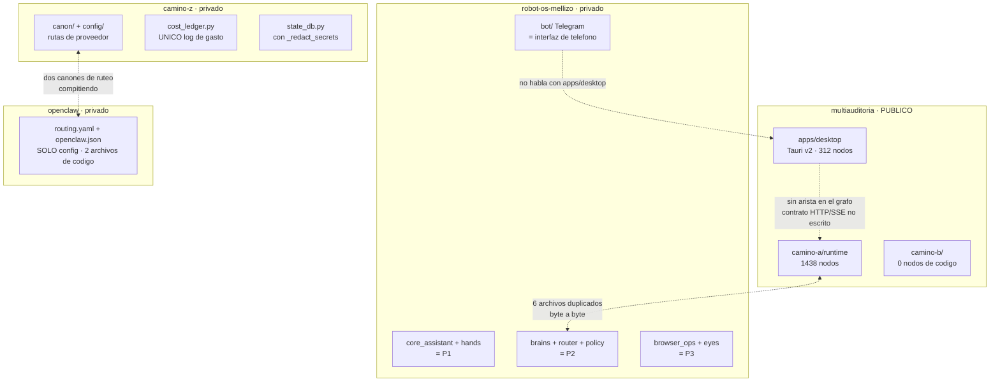
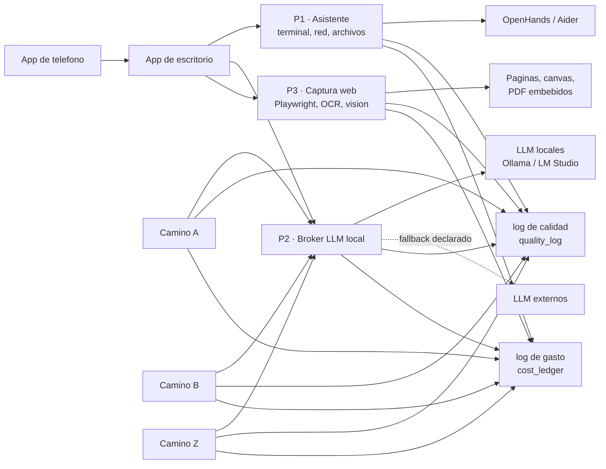
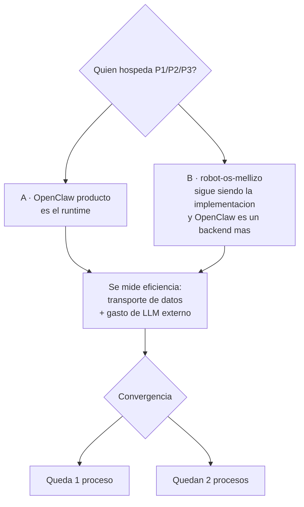

# CANON GLOBAL — ecosistema Mariano (4 repos)

**Versión:** 1.0 · **Escrito:** 2026-07-27 · **Sincronizado:** 2026-07-27

> **Copia sincronizada.** Existe idéntico en `camino-z`, `multiauditoria`,
> `robot-os-mellizo` y `openclaw`. Si editás una copia, actualizá las otras tres
> y la fecha de **Sincronizado**. Fechas distintas = divergencia.

---

## 0. Si sos una IA y entrás por primera vez, leé esto

Estás frente a **cuatro repositorios que persiguen un mismo objetivo por caminos
distintos**: multiauditar (auditar código y documentos con varios modelos que se
controlan entre sí) y automatizar tareas de escritorio.

Hoy hay **redundancia deliberada**: existen implementaciones paralelas y
experimentales para el mismo resultado, porque todavía se está midiendo cuál es
más eficiente. **No asumas que la duplicación es un error a corregir.** Parte lo
es (ver `DEUDAS.md`) y parte es experimentación en curso.

Antes de proponer cambios:

1. Leé este archivo entero.
2. Leé `DEUDAS.md` del repo donde estés.
3. Leé la sección "Contexto rápido" del `README.md`.
4. Para estructura de código real, consultá el grafo de Graphify — **no grepees
   a ciegas**: `python3 -m graphify query "<pregunta>"` parado en el repo.
5. Distinguí **estado actual** de **estado objetivo**. Los diagramas de este
   documento son el objetivo; `docs/architecture_diagram.mermaid` (donde exista)
   es el actual, derivado del código.

**Regla dura:** ninguna IA decide arquitectura. Las decisiones abiertas están en
§6 y las toma Mariano.

---

## 1. El objetivo final

### 1.1 Los tres caminos (A, B, Z) — multiauditoría

Sistemas de auditoría multi-modelo con gates, canon de identidad de modelo y
escalamiento a humano. Hoy son tres implementaciones distintas del mismo
concepto, en repos distintos.

### 1.2 OpenClaw — tres subprocesos previstos

| Proceso | Función | Estado |
|---|---|---|
| **P1 — Asistente de escritorio** | Manejo de terminal, resolución de problemas (IP, redes), buscar/borrar archivos y texto. LLM local con fallback externo. Preveía OpenHands, Aider y Telegram. | Esqueleto existente, **en robot-os-mellizo** |
| **P2 — Broker de LLM locales** | Único punto de llamada a modelos locales. Reemplaza los llamados directos de Camino A, B y Z. Doble rol: (a) auditoría corta, barata y autónoma; (b) engranaje interno de los tres caminos. | Esqueleto existente, **en robot-os-mellizo** |
| **P3 — Captura web y visión** | Playwright, OCR viewer, visión DeepSeek. Descarga de páginas con acceso legítimo pero canvas difíciles o cifrados; PDF embebidos complejos. | Esqueleto existente, **en robot-os-mellizo** |

### 1.3 Reglas de conexión que el objetivo impone

- Todo proceso —de Camino A, B, Z, de OpenClaw P2, o el equivalente de OpenHands
  y Aider— **respeta el mismo canon de salida** para poder conectarse entre sí.
- Todos se conectan a una **app de escritorio**, y a una **app de teléfono que se
  conecta a la app de escritorio**.
- **Todos escriben al log de calidad del auditor.**
- **Todos escriben al log de gasto de token.**

### 1.4 Convergencia futura

Difícilmente convivan los tres procesos de caminos y los procesos equivalentes de
OpenClaw/OpenHands haciendo lo mismo. Se medirá eficiencia y quedarán **uno o a
lo sumo dos**. Esa decisión no está tomada.

---

## 2. Contraste: objetivo vs. lo que hay hoy

### 2.1 "OpenClaw" son tres cosas distintas — nombrarlas distinto

Esta es la confusión más costosa del ecosistema:

1. **OpenClaw producto** — herramienta externa de orquestación de agentes, con el
   plugin `@glasshousehq/openclaw-routing-yaml`.
2. **Repo `openclaw`** — 15 archivos, 2 de código. Es **configuración** de ese
   producto (`routing.yaml`, `openclaw.json`, `Modelfile.qwen-abliterated-agent`,
   `guardian-openclaw-cron.py`) más informes de reparación. **No contiene P1, P2
   ni P3.**
3. **Los procesos P1/P2/P3** — el objetivo descrito en §1.2.

Cuando este documento dice "OpenClaw P2" habla del **proceso**, no del repo.

### 2.2 Los tres procesos ya tienen esqueleto — pero en robot-os-mellizo

`robot-os-mellizo/src/` contiene:

| Objetivo | Módulos que ya existen |
|---|---|
| **P1** asistente / terminal | `core_assistant/` (cli, loop, run_policy, session, tools), `hands/terminal_ops.py`, `hands/file_ops.py`, `hands/git_ops.py`, `hands/openhands_wrapper.py`, `bot/` (Telegram) |
| **P2** broker de LLM locales | `brains/m5_bridge.py`, `router/`, `policy/`, `light/`, `heavy/` (escalera de costo) |
| **P3** captura web y visión | `hands/browser_ops.py`, `eyes/watcher.py`, `docs/ot/OT-DEEPSEARCH.md` |

**OpenHands ya está envuelto** en `hands/openhands_wrapper.py`. No hay que
integrarlo: hay que decidir qué lo hospeda.

### 2.3 La consecuencia

El trabajo pendiente **no es "construir P1/P2/P3 en el repo openclaw"**. Es
decidir:

> ¿OpenClaw (producto) pasa a ser el runtime que hospeda los tres procesos, o
> `robot-os-mellizo` sigue siendo la implementación y OpenClaw es un backend más
> al que llama?

Esa es la bifurcación real, y es la misma pregunta de §1.4.

---

## 3. Las aristas — dónde se tocan los repos

Verificado el 2026-07-27 con hashes y con el grafo de Graphify.

### A1 · Ruteo de modelos: dos canones compitiendo

| Fuente | Dónde |
|---|---|
| `canon/CANON_PROVIDER_MODEL_ROUTES.v1.json`, `config/provider_endpoints.json`, `COSTOS_Y_RUTEO_v2.md` | camino-z |
| `esquema-v3-codigo/routing.yaml`, `esquema-v3-codigo/openclaw.json` | openclaw |

Ambos declaran qué modelo se usa para qué tarea. Si **P2 va a ser el único que
llama a modelos locales, uno de los dos tiene que ser la fuente de verdad.** Hoy
no está decidido y los dos evolucionan por separado.

**Esta es la arista bloqueante de P2.**

### A2 · Log de calidad: ya es canon de facto ✅

`quality_log.py` es **byte-idéntico** (`a4690efc`, 9538 bytes) en camino-z,
multiauditoria y robot-os-mellizo.

Es la única pieza del ecosistema que hoy cumple la regla "todos escriben al mismo
log". **Es el modelo a copiar para todo lo demás.** No lo toques sin sincronizar
las tres copias.

Falta en: `openclaw`.

### A3 · Log de gasto de token: existe en 1 de 4 ❌

`cost_ledger.py` existe **solo en camino-z** (15062 bytes). No está en
multiauditoria, ni en robot-os-mellizo, ni en openclaw.

El canon de §1.3 dice "todos escriben al log de gasto de token". Hoy lo cumple un
repo de cuatro. **Es la brecha más concreta entre objetivo y realidad**, y es
barata de cerrar porque el patrón ya está probado por A2.

### A4 · Runtime `camino_b` duplicado — bloquea P2

Seis archivos byte-idénticos entre `multiauditoria/camino-a/runtime/scripts/` y
`robot-os-mellizo/scripts/`: `camino_b_gateway.py`, `camino_b_outbound_agent.py`,
`camino_b_slot14_bridge.py`, `run_camino_b_bridge_smoke.py`, `state_db.py`,
`overnight_master.py`.

**No se puede centralizar las llamadas a modelos locales en P2 mientras los
llamadores sean copias que pueden divergir sin aviso.** Converger primero, migrar
después. Detalle en `DEUDAS.md` §2.

### A5 · `state_db.py`: tres copias, una con `_redact_secrets`

Si P2 centraliza, el estado tiene que ser uno solo. Hoy hay tres copias y solo la
de camino-z redacta secretos antes de persistir. Detalle en `DEUDAS.md` §1.

### A6 · Las dos apps viven lejos de los procesos

| Pieza | Repo | Nodos |
|---|---|---|
| App de escritorio (Tauri v2 + React) | `multiauditoria/apps/desktop` | 312 |
| Interfaz de teléfono (bot de Telegram) | `robot-os-mellizo/src/bot/` | — |
| Los tres procesos P1/P2/P3 | `robot-os-mellizo/src/` | — |

El canon de §1.3 pide que los tres procesos se conecten a app de escritorio y a
app de teléfono. Hoy el cliente de escritorio está **en otro repo** que el de
teléfono, y **ninguno de los dos habla con OpenClaw**.

Peor: Graphify **no detecta ninguna arista** entre `apps/desktop` y
`camino-a/runtime`. Si se hablan es por HTTP/SSE en runtime, y ese contrato **no
está documentado en ningún lado**. Es exactamente el "canon de salida" que §1.3
exige y que todavía no está escrito.

### A7 · Ningún camino escribe hoy a un broker

Camino A, B y Z llaman a modelos locales cada uno por su cuenta. El objetivo es
que deriven a P2. **Ese llamado no debe borrarse de los caminos hasta que P2 esté
probado más eficiente que el llamado genérico** (§1.2). Borrar antes deja el
sistema sin capacidad de auditar.

---

## 4. Canon global — reglas que todo proceso respeta

Aplica a Camino A, Camino B, Camino Z, OpenClaw P1/P2/P3, y a cualquier
equivalente de OpenHands o Aider.

1. **Identidad de modelo completa.** Todo registro lleva
   `step + model_id + provider_id + provider_name + route + cost_class + role`.
   Nunca nombres genéricos. El mismo modelo por distinto proveedor son entradas
   distintas. Si no se puede verificar: `NO_CONSTA`.
2. **Prohibido el fallback cruzado entre proveedores** y prohibido mezclar
   gratuito, suscripción y pago dentro de una misma corrida.
3. **Todo llamado a un LLM escribe al log de calidad** (`quality_log.py`, canon
   `a4690efc`) **y al log de gasto** (`cost_ledger.py`). Sin excepción.
4. **Fail-closed.** Ante incertidumbre, faltante, adulteración o dependencia
   ausente: bloquear, no degradar en silencio.
5. **Agotamiento de loops termina `INCOMPLETE`**, nunca en ciclo infinito. Los
   contadores de escalamiento se incrementan y se escriben (7 loops cortos / 3
   largos → humano).
6. **Canon de salida único.** Cualquier proceso que quiera conectarse a otro
   emite el mismo contrato. Mientras no esté escrito (§A6), ninguna integración
   nueva se da por terminada.
7. **Un archivo, un dueño.** No se copia código entre repos. Si dos repos lo
   necesitan, se decide una copia canónica y un mecanismo de distribución.
8. **Intervención mínima.** Antes de mutar un repo: diagnóstico read-only (diff
   contra HEAD real, baseline de tests) y recién después aplicar. Por defecto,
   ante evidencia ausente o no verificada: no aplicar.
9. **Ninguna IA decide arquitectura.** Analiza, propone, audita. Decide Mariano.
10. **No se escriben literales con forma de credencial** en el código, ni siquiera
    como canario de test. Construirlos por concatenación en runtime.

---

## 5. Diagramas

> **Dos diagramas distintos, y no se mezclan.**
> El **actual** se *deriva* del código (Graphify → `docs/architecture_diagram.mermaid`).
> El **objetivo** se *escribe a mano*, porque describe código que todavía no
> existe y por definición ningún analizador estático puede inferirlo.
> **La distancia entre los dos es el backlog.** Esa es la métrica útil.

### 5.1 Estado actual (verificado 2026-07-27)



**Lo que el diagrama dice:** cuatro repos, tres duplicaciones sin dueño, dos
canones de ruteo compitiendo, y ningún contrato escrito entre las piezas.

### 5.2 Estado objetivo



**Invariantes del objetivo:** un solo punto de llamada a modelos locales (P2);
teléfono habla con escritorio, no con los procesos; los seis productores escriben
a los dos logs; el fallback externo es declarado, nunca cruzado.

### 5.3 La bifurcación abierta



**No decidido.** Requiere medición, no opinión. Ver §6.

---

## 6. Decisiones abiertas

Ninguna de estas está tomada. Están acá para que nadie las asuma resueltas.

| # | Decisión | Bloquea a | Qué falta para decidir |
|---|---|---|---|
| D1 | ¿Quién hospeda P1/P2/P3: OpenClaw producto, o robot-os-mellizo? | Todo el plan de migración | Medición de transporte y de gasto |
| D2 | ¿Cuál es la fuente de verdad de ruteo de modelos: el canon de camino-z o `routing.yaml` de openclaw? | P2 | Decisión de arquitectura, no medición |
| D3 | ¿Se convierte Camino A/B/Z a OpenClaw con orquestación y transporte local? | Convergencia (§1.4) | Que P2 demuestre ser más barato y más eficiente |
| D4 | ¿Cuántos procesos equivalentes quedan: uno o dos? | Retiro de código | Benchmark comparativo |
| D5 | ¿La divergencia de `state_db.py` en camino-z fue deliberada? | A5, y la seguridad del repo público | Respuesta de Mariano |
| D6 | ¿Cuál es el canon de salida (contrato) entre procesos? | A6 y toda integración nueva | **En curso.** `CONTRATO_SALIDA.md` v1.1 escrito y auditado, régimen *se emite, no se exige*. Vinculante recién cuando el dato de campo confirme que los campos obligatorios son llenables |

### Orden recomendado

**D6 ya no bloquea**: el contrato existe (`CONTRATO_SALIDA.md` v1.1) y se emite
sin exigirse, así que las integraciones pueden avanzar registrando lo que no
cumple. Queda cerrarlo con dato de campo, no con más discusión.

**D2 es ahora la primera**: es decisión de escritorio, no requiere medir, y el
contrato exige `identity.route` mientras hay dos fuentes que dicen cosas
distintas. **D5 es urgente por seguridad.** D1, D3 y D4 requieren que P2 exista y
esté medido: no se deciden antes.

### Criterio de medición para D1/D3/D4

Cuando se mida, comparar contra el llamado genérico actual, no contra una
expectativa:

- costo por auditoría completa (tokens externos gastados),
- latencia de extremo a extremo,
- tasa de auditorías que terminan `INCOMPLETE` por agotamiento de loops,
- overhead de transporte de datos entre procesos.

**Un multiagente que no gana en esas cuatro no reemplaza al llamado genérico.**

---

## 7. Cómo se mantiene esto actualizado

### 7.1 Graphify — el mapa del estado actual

El grafo de conocimiento se reconstruye solo en cada `git commit` / `checkout`
(hook instalado en los 4 repos). Vive en `<repo>/graphify-out/graph.json`,
gitignoreado: es local, no viaja a GitHub.

**El CLI `graphify` no está en el PATH del iMac.** La invocación real es:

```bash
/Library/Frameworks/Python.framework/Versions/3.14/bin/python3.14 -m graphify <cmd>
```

Primera vez en una máquina nueva: `… -m graphify extract . --code-only`.
Consultas: `… -m graphify query "<pregunta>"`, `… -m graphify god-nodes`.
Los subcomandos leen `./graphify-out/graph.json` del directorio actual: **hay que
estar parado en el repo correcto.**

### 7.2 Diagrama actual — generado, no editado

En `multiauditoria`: `python3 tools/graph_to_mermaid.py` regenera
`docs/architecture_diagram.mermaid` desde el grafo. **No editarlo a mano.**

### 7.3 Diagrama objetivo — este archivo, a mano

Los diagramas de §5.2 y §5.3 describen código que no existe. No se derivan de
nada. Se editan acá, y **cuando una pieza del objetivo se implementa, se mueve de
§5.2 a §5.1 y se verifica contra el grafo.**

### 7.4 Cuándo revisar este documento

- Cuando se cierre cualquier decisión de §6.
- Cuando una arista de §3 se resuelva o aparezca una nueva.
- Cuando un proceso de §1.2 pase de esqueleto a implementación.

Al editar: subir la **Versión**, actualizar **Sincronizado**, y propagar a los
cuatro repos. Fechas distintas entre copias = alguien editó una sola.
