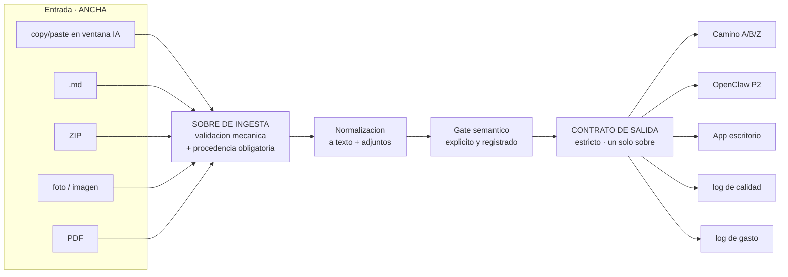

# CONTRATO DE SALIDA — canon de interoperación

**Versión:** 1.0 · **Escrito:** 2026-07-27 · **Sincronizado:** 2026-07-27
**Estado:** especificación. La materialización (schema, validadores) es trabajo derivado.

> Copia sincronizada en los 4 repos. Ver `CANON_GLOBAL.md` §D6.

---

## 0. El problema que resuelve

La entrada es **multiforma y va a seguir siéndolo**: en la fase de incorporación
manual entran auditorías por copy/paste en una ventana de IA, archivos `.md`,
ZIPs, fotos, imágenes, PDFs. Eso es un requisito, no un defecto.

Hoy eso trae problemas para consolidar en Camino A, B o Z, y **según la
inteligencia del orquestador muchas veces se rechaza**.

Ahí está el diagnóstico: se está validando entrada multiforma contra un contrato
pensado para la salida, y la decisión de aceptar o rechazar la toma un modelo.
**Un LLM decidiendo validez de esquema es no determinista**: el mismo ZIP entra
un martes y se rechaza un jueves, y nadie puede contar por qué.

La regla que sigue de esto:

> **La entrada se acepta ancha y se normaliza. La salida se emite angosta y
> estricta. La decisión de aceptar es mecánica; la decisión semántica es un gate
> posterior, explícito y registrado.**

---

## 1. La cintura angosta



**Muchas formas de entrada, un sobre, muchos consumidores.** El error de hoy es
que no hay cintura: cada camino valida a su manera y rechaza a su criterio.

**Consecuencia dura:** el contrato de salida tiene una dependencia real sobre la
ingesta. No se puede emitir `input_ref.sha256` si nadie hasheó el paste. **Si la
ingesta no registra procedencia, el contrato de salida no se puede honrar.**

---

## 2. Sobre de ingesta (entrada multiforma)

Lo mínimo que la ingesta debe registrar para que la salida sea emitible.
**Aceptación mecánica**: si estos campos están, entra. No hay juicio de modelo.

| Campo | Tipo | Obligatorio | Nota |
|---|---|---|---|
| `ingest_id` | uuid | sí | Identidad única del material que entró |
| `form` | enum | sí | `paste` · `md` · `zip` · `image` · `pdf` · `file` · `other` |
| `received_at` | ISO-8601 UTC | sí | |
| `origin` | enum | sí | `manual_human` · `manual_ai_window` · `automated` |
| `declared_by` | string | sí | Quién dice haberlo producido. Si no consta: `NO_CONSTA` |
| `raw_sha256` | hex64 | sí | Hash de los bytes tal como llegaron |
| `raw_bytes` | int | sí | |
| `filename` | string | no | `null` para paste |
| `container_items` | array | condicional | Obligatorio si `form=zip`: nombre + sha256 de cada ítem |
| `normalized_sha256` | hex64 | sí | Hash del texto normalizado |
| `normalization` | enum | sí | `none` · `text_extract` · `ocr` · `unzip_flatten` |
| `ocr_confidence` | float | condicional | Obligatorio si `normalization=ocr` |

### Reglas

1. **`form` no se infiere del contenido.** Lo declara quien ingesta. Adivinar el
   formato es la puerta de entrada al rechazo no determinista.
2. **ZIP se aplana y se hashea ítem por ítem.** Un ZIP nunca entra como opaco.
3. **`image` y `pdf` escaneado exigen `ocr_confidence`.** Por debajo del umbral no
   se rechaza: entra con `status=INCOMPLETE` y `reason_code=OCR_LOW_CONFIDENCE`.
   **Degradar a un estado declarado, no descartar en silencio.**
4. **Nada se rechaza en ingesta salvo que falte un campo obligatorio.** Todo juicio
   sobre si el contenido sirve pertenece al gate semántico, que emite contrato y
   queda registrado.

---

## 3. El sobre de salida

Un solo sobre. Lo emite **todo** proceso que produzca un resultado: Camino A, B,
Z, OpenClaw P1/P2/P3, OpenHands, Aider.

```jsonc
{
  "canon_version": "1.0",
  "emitted_at": "2026-07-27T23:41:07Z",

  "producer": {                   // QUIEN lo emitio (la maquina/proceso)
    "process": "openclaw_p2",     // enum cerrado, §4.1
    "repo": "robot-os-mellizo",
    "commit": "1a2c961",
    "host": "mbp"                 // imac | mbp
  },

  "identity": {                   // QUE modelo lo produjo — canon Camino B
    "step": "audit_k3",
    "model_id": "qwen3-coder-30b-abliterated",
    "provider_id": "ollama-local",
    "provider_name": "Ollama",
    "route": "ollama/qwen-abliterated-agent",
    "cost_class": "LOCAL",        // §4.3
    "role": "auditor"             // §4.4
  },

  "job": {                        // DONDE encaja
    "run_id": "uuid",
    "job_id": "uuid",
    "parent_job_id": "uuid|null", // fan-out: quien lo lanzo
    "fanout_index": 3,            // null si no es paralelo
    "fanout_total": 6,
    "task_class": "code_agent_loop",
    "loop_index": 2               // para los contadores de escalamiento
  },

  "input_ref": {                  // DE QUE material salio — §2
    "ingest_id": "uuid",
    "form": "zip",
    "raw_sha256": "…",
    "normalized_sha256": "…"
  },

  "result": {
    "status": "OK",               // §4.2 — enum cerrado de 4
    "reason_code": null,          // OBLIGATORIO si status != OK
    "payload_sha256": "…",
    "payload": { }                // libre, pero hasheado
  },

  "timing": { "started_at": "…", "ended_at": "…", "duration_ms": 8140 },

  "cost": {
    "tokens_in": 18422, "tokens_out": 1190,
    "cost_class": "LOCAL", "estimated_cost_usd": 0.0
  },

  "quality": {
    "obligations_met": true,
    "findings": 2,
    "blocking": false
  },

  "chain": { "prev_sha256": "…", "self_sha256": "…" }
}
```

---

## 4. Enums cerrados

**Nada de estos campos es texto libre.** Un enum abierto se convierte en texto
libre en tres semanas y deja de ser contable.

### 4.1 `producer.process`

`camino_a` · `camino_b` · `camino_z` · `openclaw_p1` · `openclaw_p2` ·
`openclaw_p3` · `openhands` · `aider` · `desktop_app` · `mobile_app`

### 4.2 `result.status` — exactamente cuatro

| Valor | Significado | No confundir con |
|---|---|---|
| `OK` | Produjo resultado y cumplió sus obligaciones | — |
| `INCOMPLETE` | Terminó sin completar: loops agotados, OCR bajo, contexto insuficiente | No es error: es un final declarado |
| `BLOCKED` | Fail-closed. Faltante, adulteración, dependencia ausente, identidad no verificable | No es rechazo: el material podía servir |
| `REJECTED` | El material no corresponde a este paso | No es `BLOCKED`: acá no hubo anomalía |

Distinguir `BLOCKED` de `REJECTED` es lo que hoy no se puede hacer, y es la razón
por la que "muchas veces se rechaza" sin que nadie pueda contar por qué.

### 4.3 `identity.cost_class`

`LOCAL` · `FREE_QUOTA` · `PAID_CHEAP` · `VIBE`
(`VIBE` = autorizado por humano.)

### 4.4 `identity.role`

`orchestrator` · `writer` · `auditor` · `verifier` · `reviewer` · `scribe` ·
`arbiter`

### 4.5 `result.reason_code` — obligatorio si `status != OK`

`OCR_LOW_CONFIDENCE` · `CONTEXT_OVERFLOW` · `LOOPS_EXHAUSTED` ·
`SCHEMA_FIELD_MISSING` · `HASH_MISMATCH` · `IDENTITY_UNVERIFIABLE` ·
`PROVIDER_UNAVAILABLE` · `CROSS_PROVIDER_FALLBACK_FORBIDDEN` ·
`SECRET_DETECTED` · `PATH_TRAVERSAL` · `SYMLINK_ESCAPE` ·
`OUT_OF_SCOPE_FOR_STEP` · `DUPLICATE_SUBMISSION` · `UNSUPPORTED_FORM`

**Ampliable, pero solo por edición de este documento en los 4 repos.** Un
`reason_code` nuevo inventado en runtime es una violación del canon.

---

## 5. Reglas de emisión

1. **Un sobre por unidad de trabajo.** No se agrupan resultados de varios modelos
   en un sobre: rompe la identidad.
2. **La identidad va completa o el sobre sale `BLOCKED`** con
   `IDENTITY_UNVERIFIABLE`. Nunca nombres genéricos. El mismo modelo por distinto
   proveedor son sobres distintos.
3. **Un solo write, dos derivaciones.** El sobre se escribe una vez; el log de
   calidad y el log de gasto se derivan de él. **Nunca dos escrituras
   independientes**: es como los dos logs se desincronizan.
4. **`payload` es libre pero `payload_sha256` es obligatorio.** El contrato no
   opina sobre el contenido; garantiza que no cambió.
5. **`chain.prev_sha256` encadena.** El sobre N apunta al N-1 del mismo `run_id`.
   Un hueco en la cadena es truncamiento y se trata como `BLOCKED`.
6. **`emitted_at` en UTC.** Hay dos máquinas; hora local es ambigua.
7. **Fallback cruzado entre proveedores prohibido.** Si el proveedor cae, sale
   `BLOCKED` + `PROVIDER_UNAVAILABLE`. No se reemplaza por otro y se sigue.
8. **`loop_index` se incrementa y se escribe.** Es lo que hace que las compuertas
   de escalamiento (7 cortos / 3 largos) disparen alguna vez.
9. **Ningún proceso lee el sobre de otro para decidir.** Se leen los logs. Un
   proceso que lee sobres de otro crea acoplamiento que el grafo no ve.

---

## 6. Proyección a escritorio y teléfono

El sobre es el formato de **interoperación entre procesos**, no el formato de UI.

| Consumidor | Qué ve | Autoridad |
|---|---|---|
| Otro proceso | Sobre completo | Sí |
| Log de calidad / gasto | Derivación del sobre | Sí |
| **App de escritorio** | Sobre completo por HTTP/SSE | Sí, es el único puente |
| **App de teléfono** | **Proyección** del sobre: `status`, `reason_code`, `process`, `identity.model_id`, `timing.duration_ms`, `cost` | **No** |

### Reglas

1. **El teléfono habla con el escritorio, nunca con un proceso.** Una sola
   frontera de autenticación.
2. **La proyección al teléfono es de solo lectura y sin `payload`.** El payload
   puede traer material sensible del expediente; el teléfono es el dispositivo
   más fácil de perder.
3. **El teléfono no es fuente de verdad de nada.** Si escritorio y teléfono
   discrepan, manda escritorio.
4. **La proyección se define acá, no en la app.** Si el móvil necesita un campo
   nuevo, se agrega a esta tabla primero.

---

## 7. Cómo esto habilita la medición de P2 (en curso)

P2 se está midiendo ahora, y todavía se prueba paralelismo con TaskCard u otros
métodos. **El contrato es lo que convierte esa medición en una consulta sobre el
log, en vez de instrumentación aparte que hay que rehacer con cada método.**

Los campos que hacen la medición posible:

| Métrica de `CANON_GLOBAL.md` §6 | Se calcula con |
|---|---|
| Costo por auditoría completa | `sum(cost.estimated_cost_usd) group by run_id` |
| Latencia extremo a extremo | `max(timing.ended_at) - min(timing.started_at) by run_id` |
| Tasa de `INCOMPLETE` por loops | `count(status=INCOMPLETE AND reason_code=LOOPS_EXHAUSTED) / count(run_id)` |
| Overhead de transporte | `duration_ms` del sobre padre − `sum(duration_ms)` de los hijos |

### Por qué `fanout_index` / `fanout_total` / `parent_job_id` importan ya

Sin esos tres campos, seis resultados paralelos son seis sobres sueltos y **no se
puede reconstruir si el paralelismo ganó algo**. Con ellos:

- se detecta el **hijo más lento** (el que fija la latencia real del fan-out),
- se detecta **fan-out incompleto** (`count(hijos) < fanout_total` = alguien se
  perdió en silencio),
- se compara **el mismo trabajo en serie vs en paralelo** sobre el mismo `run_id`.

**Esto es agnóstico de TaskCard.** Si mañana el método de paralelismo cambia, los
campos siguen sirviendo: describen la forma del fan-out, no la herramienta.

> **Recomendación de secuencia:** emitir el sobre —aunque sea solo desde P2 y
> aunque el resto siga como está— **antes** de terminar la medición. Medir sin
> contrato produce números que no se van a poder comparar con los de la próxima
> iteración.

---

## 8. Fuera de alcance de este documento

- El **schema JSON materializado** y los validadores: trabajo derivado.
- El **transporte** (HTTP/SSE, colas, ficheros): el sobre es agnóstico a propósito.
- El **formato del payload** por tipo de tarea.
- La **retención** de sobres y logs.
- **Quién hospeda P1/P2/P3** (`CANON_GLOBAL.md` D1) y **cuál canon de ruteo manda**
  (D2). Este contrato es compatible con cualquiera de las dos salidas.
