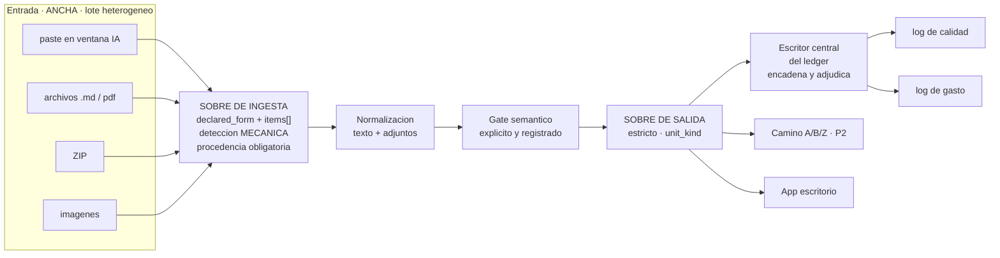

# CONTRATO DE SALIDA — canon de interoperación

**Versión:** 1.1 · **Escrito:** 2026-07-27 · **Sincronizado:** 2026-07-27
**Estado:** especificación **no vinculante**. Se emite, no se exige. Ver §9.

> Copia sincronizada en los 4 repos. Ver `CANON_GLOBAL.md` D6.
> v1.1 incorpora 13 correcciones de la auditoría de Codex (modelo `NO_CONSTA`),
> verificadas contra el código real. Changelog en §10.

---

## 0. El problema que resuelve

La entrada es **multiforma y va a seguir siéndolo**: en la incorporación manual
entran auditorías por copy/paste en una ventana de IA, archivos `.md`, ZIPs,
fotos, imágenes, PDFs — **y combinaciones de todo eso en un mismo lote**.
`manual_harvest.py` lo dice en su docstring: *"3 textos pegados en 1 input"*.
Eso es un requisito, no un defecto.

Hoy eso trae problemas para consolidar en Camino A, B o Z, y **según la
inteligencia del orquestador muchas veces se rechaza**.

El diagnóstico: se valida entrada multiforma contra un contrato pensado para la
salida, y la decisión de aceptar la toma un modelo. **Un LLM decidiendo validez
de esquema es no determinista**: el mismo ZIP entra un martes y se rechaza un
jueves, y nadie puede contar por qué.

De ahí la regla:

> **La entrada se acepta ancha y se normaliza. La salida se emite angosta.
> La detección de formato es mecánica y reproducible. Ningún modelo decide
> formato ni admisibilidad. El juicio semántico es un gate posterior, explícito
> y registrado.**

**Detectar por extensión o magic bytes está permitido y es lo correcto** — es
determinista. Lo prohibido es que un modelo opine si el material sirve.

---

## 1. La cintura angosta



**Muchas formas de entrada, un sobre, muchos consumidores.**

Dos dependencias duras que se desprenden del diagrama:

1. **Si la ingesta no registra procedencia, la salida no se puede emitir.** No se
   puede poner `input_ref.raw_sha256` si nadie hasheó el paste.
2. **El encadenamiento y la adjudicación NO los hace el emisor.** Los hace el
   escritor central en el fan-in. Un hijo paralelo no sabe cuál sobre lo precede,
   y ningún productor puede certificar sus propias obligaciones.

---

## 2. Sobre de ingesta (entrada multiforma)

**Aceptación mecánica**: si están los campos obligatorios, entra. Sin juicio de
modelo.

### 2.1 Nivel lote

| Campo | Tipo | Oblig. | Nota |
|---|---|---|---|
| `ingest_id` | uuid | sí | Identidad del lote que entró |
| `declared_form` | enum | sí | `paste` · `file` · `batch` · `other`. **Lo determina la acción de ingreso, no se le pregunta al humano** |
| `received_at` | ISO-8601 UTC | sí | |
| `origin` | enum | sí | `manual_human` · `manual_ai_window` · `automated` |
| `declared_by` | string | sí | Quién dice haberlo producido. Si no consta: `NO_CONSTA` |
| `batch_sha256` | hex64 | sí | Hash superior del lote (sobre los `item_sha256` ordenados) |
| `item_count` | int | sí | |
| `items[]` | array | sí | Al menos uno. §2.2 |

### 2.2 Nivel ítem

| Campo | Tipo | Oblig. | Nota |
|---|---|---|---|
| `item_id` | string | sí | Único dentro del lote |
| `detected_format` | enum | sí | `md` · `txt` · `zip` · `image` · `pdf` · `json` · `binary` · `unknown`. **Detectado mecánicamente** (extensión, magic bytes) |
| `detection_method` | enum | sí | `extension` · `magic_bytes` · `declared` |
| `raw_sha256` | hex64 | sí | Bytes tal como llegaron |
| `raw_bytes` | int | sí | |
| `filename` | string | no | `null` para paste |
| `container_items[]` | array | cond. | Si `detected_format=zip`: nombre + sha256 de cada entrada |
| `normalized_sha256` | hex64 | sí | Hash del texto normalizado |
| `normalization` | enum | sí | `none` · `text_extract` · `ocr` · `unzip_flatten` |
| `ocr_confidence` | float | cond. | Obligatorio si `normalization=ocr` |

### 2.3 Reglas

1. **`declared_form` es el canal, `detected_format` es el formato.** Son cosas
   distintas y por eso son dos campos. Un lote de `declared_form=batch` puede
   tener ítems `md`, `zip` e `image` a la vez.
2. **Un ZIP nunca entra opaco.** Se aplana y se hashea entrada por entrada.
3. **OCR con baja confianza no se descarta:** entra con `status=INCOMPLETE` y
   `reason_code=INGEST_OCR_LOW_CONFIDENCE`. Degradar a estado declarado, nunca
   descartar en silencio.
4. **En ingesta solo se rechaza por campo obligatorio faltante.** Todo juicio
   sobre si el contenido sirve pertenece al gate semántico, que emite sobre.

---

## 3. El sobre de salida

```jsonc
{
  "canon_version": "1.1",
  "emitted_at": "2026-07-27T23:41:07Z",
  "unit_kind": "llm_call",        // §4.1 — DISCRIMINADOR: define que campos obligan

  "producer": {
    "process": "openclaw_p2",     // §4.2
    "repo": "robot-os-mellizo",
    "commit": "03b95da",
    "component": "brains.m5_bridge",
    "component_version": "1.4.0",
    "host": "mbp"
  },

  "identity": {                   // OBLIGATORIO solo si unit_kind=llm_call
    "step": "audit_k3",
    "model_id": "qwen3-coder-30b-abliterated",
    "provider_id": "ollama-local",
    "provider_name": "Ollama",
    "route": "ollama/qwen-abliterated-agent",
    "role": "auditor"             // §4.5
  },

  "job": {
    "run_id": "uuid",
    "job_id": "uuid",
    "attempt_id": "uuid",         // los reintentos comparten job_id
    "attempt_index": 1,
    "parent_job_id": "uuid|null",
    "fanout_index": 3,
    "fanout_total": 6,
    "task_class": "code_agent_loop",
    "loop_index": 2
  },

  "input_ref": {                  // DE QUE material entro — §2
    "ingest_id": "uuid",
    "batch_sha256": "…",
    "item_ids": ["…"]
  },

  "subject_ref": {                // QUE se audito realmente. Puede diferir del input
    "candidate_sha256": "…",      // tras una correccion, input != candidato
    "candidate_label": "slot14/rev3"
  },

  "result": {
    "status": "OK",               // §4.6 — enum cerrado de 4
    "reason_code": null,          // OBLIGATORIO si status != OK
    "reason_detail": null,
    "payload_sha256": "…",
    "payload": { }
  },

  "timing": { "started_at": "…", "ended_at": "…", "duration_ms": 8140 },

  "cost": {                       // OBLIGATORIO solo si unit_kind=llm_call
    "cost_class": "LOCAL",        // §4.3 — contabilidad. UNICA fuente
    "authorization_tier": "AUTO", // §4.4 — quien autorizo. Eje independiente
    "tokens_in": 18422,
    "tokens_out": 1190,
    "tokens_basis": "provider_reported",  // provider_reported | estimated | unknown
    "estimated_cost_usd": 0.0,
    "cost_basis": "provider_reported"
  },

  "quality": {                    // El productor NO se autocertifica
    "findings": 2,
    "blocking": false,
    "self_reported_only": true,
    "adjudication": "PENDIENTE"   // lo completa un verificador o arbitro
  }
}
```

> **`chain` ya no está en el sobre.** El encadenamiento lo hace el escritor
> central del ledger en el fan-in, que es el único que conoce el orden. Ver §5.

---

## 4. Enums cerrados

Nada de esto es texto libre. Un enum abierto se vuelve texto libre en tres
semanas y deja de ser contable.

### 4.1 `unit_kind` — el discriminador

Define **qué bloques obligan**. Sin esto, un gate determinista sale `BLOCKED` por
no tener `model_id`, que es el defecto que hundía a v1.0.

| `unit_kind` | Obliga | No aplica |
|---|---|---|
| `llm_call` | `identity` completa + `cost` completo | — |
| `manual_evidence` | `producer.declared_by` | `identity.model_id` puede ser `NO_CONSTA`; sin `cost` |
| `deterministic_step` | `producer.component` + `component_version` + `commit` | sin `identity` LLM, sin `cost` |
| `run_summary` | referencias a los sobres hijos (`job.run_id` + lista de `job_id`) | no se atribuye a un modelo único |

### 4.2 `producer.process`

`camino_a` · `camino_b` · `camino_z` · `openclaw_p1` · `openclaw_p2` ·
`openclaw_p3` · `openhands` · `aider` · `desktop_app` · `ledger_writer`

**`mobile_app` no está**: §6 declara que el teléfono no tiene autoridad, así que
no puede ser productor de resultados autoritativos.

### 4.3 `cost_class` — contabilidad

`LOCAL` · `FREE_QUOTA` · `SUBSCRIPTION` · `CREDIT` · `PAYG` · `MANUAL`

Mapeo desde `config/budget.policy.json`:

| Valor en producción | `cost_class` |
|---|---|
| `free_local` | `LOCAL` |
| `included_in_plan` | `FREE_QUOTA` |
| `flat_subscription` | `SUBSCRIPTION` |
| `vertex_credit`, `prepaid_token_plan` | `CREDIT` |
| `paid_intermediate` | `PAYG` |
| `manual` | `MANUAL` |

### 4.4 `authorization_tier` — quién autorizó

`AUTO` · `HUMAN_AUTHORIZED`

**Eje independiente del costo.** `VIBE` de la escalera de escalamiento es
`authorization_tier=HUMAN_AUTHORIZED`, no una clase de costo: la escalera
(`LOCAL → FREE_QUOTA → PAID_CHEAP → VIBE`) mezclaba contabilidad con
autorización. Acá se separan y la escalera sigue funcionando igual.

### 4.5 `identity.role`

`orchestrator` · `writer` · `auditor` · `verifier` · `reviewer` · `scribe` ·
`arbiter`

### 4.6 `result.status` — exactamente cuatro

| Valor | Significado | No confundir con |
|---|---|---|
| `OK` | Produjo resultado | — |
| `INCOMPLETE` | Terminó sin completar: loops agotados, OCR bajo, timeout | No es error: es un final declarado |
| `BLOCKED` | Fail-closed: faltante, adulteración, dependencia ausente | No es rechazo: el material podía servir |
| `REJECTED` | El material no corresponde a este paso | Acá no hubo anomalía |

Distinguir `BLOCKED` de `REJECTED` es lo que hoy no se puede hacer, y por eso
"muchas veces se rechaza" sin que nadie pueda contar por qué.

### 4.7 `reason_code` — obligatorio si `status != OK`

Agrupados por familia para poder agregar al medir.

**`INGEST_`** — material de entrada
`INGEST_OCR_LOW_CONFIDENCE` (INCOMPLETE) · `INGEST_UNSUPPORTED_FORM` (BLOCKED) ·
`INGEST_LIMIT_EXCEEDED` (BLOCKED) · `INGEST_CONTENT_UNREADABLE` (BLOCKED) ·
`INGEST_SCHEMA_FIELD_MISSING` (BLOCKED)

**`EXEC_`** — ejecución
`EXEC_EXECUTOR_UNAVAILABLE` (BLOCKED) · `EXEC_AUTHENTICATION_FAILED` (BLOCKED) ·
`EXEC_QUOTA_EXHAUSTED` (BLOCKED) · `EXEC_PROVIDER_UNAVAILABLE` (BLOCKED) ·
`EXEC_TIMEOUT` (INCOMPLETE) · `EXEC_CONTEXT_OVERFLOW` (INCOMPLETE) ·
`EXEC_LOOPS_EXHAUSTED` (INCOMPLETE) · `EXEC_OUTPUT_MISSING` (BLOCKED)

**`INTEG_`** — integridad
`INTEG_HASH_MISMATCH` (BLOCKED) · `INTEG_CANDIDATE_STALE` (REJECTED) ·
`INTEG_OUTPUT_CONTRACT_INVALID` (BLOCKED) · `INTEG_IDENTITY_UNVERIFIABLE` (BLOCKED) ·
`INTEG_IDEMPOTENCY_CONFLICT` (REJECTED) · `INTEG_PATH_TRAVERSAL` (BLOCKED) ·
`INTEG_SYMLINK_ESCAPE` (BLOCKED) · `INTEG_SECRET_DETECTED` (BLOCKED)

**`POLICY_`** — política y gates
`POLICY_CROSS_PROVIDER_FALLBACK_FORBIDDEN` (BLOCKED) ·
`POLICY_OUT_OF_SCOPE_FOR_STEP` (REJECTED) · `POLICY_EVIDENCE_INSUFFICIENT` (INCOMPLETE) ·
`POLICY_TERMINAL_GATE_FAILED` (BLOCKED) · `POLICY_OPERATOR_ACTION_REQUIRED` (BLOCKED) ·
`POLICY_FINALIZATION_FAILED` (BLOCKED)

**Criterio de admisión:** un código entra solo si **la acción que dispara es
distinta** de la de todos los demás. Si no sabés qué harías diferente al verlo,
no es un código: es `reason_detail`.

**`EXEC_PROVIDER_UNAVAILABLE` es solo caída real del proveedor.** No absorbe
autenticación, cuota, ejecutor ni configuración: las acciones son distintas.

**`INTEG_IDEMPOTENCY_CONFLICT` reemplaza a `DUPLICATE_SUBMISSION`, y no es un
rename.** Mismo contenido + misma clave **no es error**: se devuelve el resultado
original con `status=OK`. El conflicto es misma clave con contenido distinto.

Ampliable solo por edición de este documento en los 4 repos. Un código inventado
en runtime es violación del canon.

---

## 5. Reglas de emisión

1. **Un sobre por unidad de trabajo.** No se agrupan resultados de varios modelos
   en un sobre: rompe la identidad.
2. **`unit_kind` primero.** Se declara antes de validar cualquier otro bloque.
   Validar identidad sin saber si es un `llm_call` es lo que bloqueaba todo en v1.0.
3. **Identidad completa solo para `llm_call`**, y ahí sí completa o
   `INTEG_IDENTITY_UNVERIFIABLE`. Nunca nombres genéricos.
4. **Reintentos comparten `job_id` y cambian `attempt_id`.** Es como lo modela
   `state_db.py`, que tiene `attempts(attempt_id PK, job_id FK)`.
5. **`input_ref` y `subject_ref` son distintos y ambos se registran.** El material
   que entró y el candidato auditado divergen después de una corrección.
6. **`payload` es libre; `payload_sha256` es obligatorio.** El contrato no opina
   sobre el contenido, garantiza que no cambió.
7. **El emisor no encadena y no adjudica.** `chain` y `quality.adjudication` los
   escribe el ledger central en el fan-in. Un hijo paralelo no sabe qué lo precede
   y ningún productor certifica sus propias obligaciones.
8. **Un solo write, dos derivaciones.** El sobre se escribe una vez; los logs de
   calidad y de gasto se derivan de él. Nunca dos escrituras independientes: así
   es como los dos logs se desincronizan.
9. **`emitted_at` en UTC.** Hay dos máquinas.
10. **Fallback cruzado prohibido.** Si cae el proveedor: `BLOCKED` +
    `EXEC_PROVIDER_UNAVAILABLE`. No se reemplaza por otro y se sigue.
11. **`loop_index` se incrementa y se escribe.** Es lo que hace que las compuertas
    de escalamiento (7 cortos / 3 largos) disparen alguna vez.
12. **Ningún proceso lee el sobre de otro para decidir.** Se leen los logs.

---

## 6. Proyección a escritorio y teléfono

| Consumidor | Qué ve | Autoridad |
|---|---|---|
| Otro proceso | Sobre completo | Sí |
| Ledger / logs | Derivación del sobre | Sí |
| **App de escritorio** | Sobre completo por HTTP/SSE | Sí, único puente |
| **App de teléfono** | Proyección: `unit_kind`, `status`, `reason_code`, `process`, `identity.model_id`, `timing.duration_ms`, `cost` | **No** |

1. **El teléfono habla con el escritorio, nunca con un proceso.** Una sola
   frontera de autenticación.
2. **La proyección es de solo lectura y sin `payload`.** El payload puede traer
   material de expediente; el teléfono es el dispositivo más fácil de perder.
3. **Si escritorio y teléfono discrepan, manda escritorio.**
4. **La proyección se define acá, no en la app.**

---

## 7. Medición de P2 (en curso)

El contrato convierte la medición en una consulta sobre el log, en vez de
instrumentación que hay que rehacer con cada método de paralelismo.

| Métrica (`CANON_GLOBAL.md` §6) | Se calcula con |
|---|---|
| Costo por auditoría | `sum(cost.estimated_cost_usd) group by job.run_id`, **segmentado por `cost_basis`** |
| Latencia extremo a extremo | `max(timing.ended_at) - min(timing.started_at) by run_id` |
| Tasa de `INCOMPLETE` por loops | `count(reason_code=EXEC_LOOPS_EXHAUSTED) / count(run_id)` |
| Overhead de transporte | `duration_ms` del padre − `sum(duration_ms)` de los hijos |

### Núcleo estable (emitir ya)

Estos campos **no van a cambiar** cualquiera sea el resultado de la auditoría
pendiente, porque describen la forma del trabajo y no la política:

`job.run_id` · `job.job_id` · `job.attempt_id` · `job.parent_job_id` ·
`job.fanout_index` · `job.fanout_total` · `timing.*` ·
`cost.tokens_in` · `cost.tokens_out` · `cost.tokens_basis`

**`cost.cost_class` se registra en crudo, como venga de `budget.policy.json`.**
Normalizar al enum de §4.3 es una transformación posterior sobre lo ya guardado.
Un valor crudo registrado siempre se puede normalizar después; un valor que no se
registró no se recupera nunca.

### Por qué `fanout_*` y `attempt_id` importan ya

Sin `parent_job_id` + `fanout_index` + `fanout_total`, seis resultados paralelos
son seis sobres sueltos y no se puede reconstruir si el paralelismo ganó algo.
Con ellos:

- se detecta el **hijo más lento**, que fija la latencia real del fan-out (no el
  promedio, que la esconde),
- se detecta **fan-out incompleto**: `count(hijos) < fanout_total` es alguien que
  se perdió en silencio,
- se compara el **mismo trabajo en serie contra en paralelo** sobre el mismo `run_id`.

Sin `attempt_id`, tres reintentos de un job lento se ven como tres trabajos
distintos y **el costo del reintento se cuenta como throughput**.

**Todo esto es agnóstico de TaskCard**: describe la forma del fan-out, no la
herramienta. Si cambia el método, las mediciones viejas siguen comparables.

---

## 8. Régimen: se emite, no se exige

**v1.1 no es vinculante.** Hasta nuevo aviso:

- Los procesos **emiten** el sobre.
- La validación **registra** lo que no cumple; **no bloquea**.
- Los `reason_code` que dispararía la validación se acumulan como dato de campo.

El contrato se vuelve vinculante recién cuando ese dato confirme que los campos
obligatorios son llenables en producción. Escribir v1.2 desde el campo, en vez de
por deducción, es exactamente lo que le faltó a v1.0.

---

## 9. Fuera de alcance

- Schema JSON materializado y validadores: trabajo derivado.
- Transporte (HTTP/SSE, colas, ficheros): el sobre es agnóstico a propósito.
- Formato del `payload` por tipo de tarea.
- Retención de sobres y logs.
- **D1** (quién hospeda P1/P2/P3) y **D2** (qué canon de ruteo manda). El
  contrato es compatible con cualquiera de las dos salidas.

---

## 10. Changelog

### v1.1 — 2026-07-27

Trece correcciones sobre v1.0, de la auditoría de Codex (modelo `NO_CONSTA`).

> Las citas por número de línea de ese informe estaban corridas entre 10 y 30
> líneas. **El contenido se verificó por símbolo contra el código real: 7/7
> correcto.** Quien implemente esto debe buscar por símbolo, nunca por número
> de línea.

| # | Cambio | Motivo |
|---|---|---|
| 1 | `unit_kind` como discriminador | v1.0 exigía identidad de modelo a gates deterministas, evidencia manual y resúmenes: todos salían `BLOCKED` |
| 2 | `chain` sale del sobre | Un hijo paralelo no sabe qué sobre lo precede; encadena el ledger central |
| 3 | `subject_ref.candidate_sha256` | Input y candidato auditado divergen tras una corrección. Ya es obligatorio en el schema de Camino B |
| 4 | `job.attempt_id` + `attempt_index` | `state_db.py` ya modela `attempts(attempt_id PK, job_id FK)` |
| 5 | `quality.adjudication` reemplaza a `obligations_met` | El productor no se autocertifica. Camino A registra `PENDIENTE` |
| 6 | `cost_class` con una sola fuente | Estaba duplicado en `identity` y en `cost` |
| 7 | `authorization_tier` separado de `cost_class` | `VIBE` es autorización humana, no clase de costo |
| 8 | Enum de `cost_class` reescrito | Ninguno de los cuatro valores de v1.0 existía en `budget.policy.json` |
| 9 | `tokens_basis` y `cost_basis` | `cost_ledger.py` ya distingue `tokens_estimated` y `cost_unknown` |
| 10 | `declared_form` + `items[].detected_format` | v1.0 mezclaba canal con formato y no representaba lotes heterogéneos |
| 11 | La no-inferencia se acota a modelos | Detectar por extensión es determinista y correcto; `manual_harvest.py` ya lo hace |
| 12 | 13 `reason_code` nuevos, agrupados por familia | Modos de falla reales de Camino A/B con acciones distintas |
| 13 | `mobile_app` sale de `producer.process` | §6 dice que el teléfono no tiene autoridad |

### v1.0 — 2026-07-27

Primera versión. Cerraba D6.
