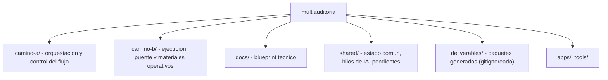

# multiauditoria

> ## Leer primero
> **[`CANON_GLOBAL.md`](CANON_GLOBAL.md)** — objetivo final del ecosistema de 4 repos,
> aristas donde se tocan, reglas que todo proceso respeta, diagramas de estado
> actual y objetivo, y decisiones abiertas. Sincronizado entre los 4 repos.
> Cualquier IA que entre a trabajar aca debe leerlo antes de proponer cambios.

Repo base para coordinar Camino A, Camino B y el material compartido entre GPT, GLM, Claude y Codex.

## Contexto rápido (para vos y para cualquier IA — leer primero)

Repo **público**. Forma parte de un ecosistema más grande junto a otros
proyectos relacionados en la misma máquina que comparten arquitectura de
canon/slots — ese detalle se mantiene fuera de este repo público a propósito.

Decisiones pendientes: ver `DECISIONES_PENDIENTES.md` en esta misma carpeta.

**Deuda tecnica abierta: ver [`DEUDAS.md`](DEUDAS.md).** Lo que se sabe que
esta mal o sin decidir, relevado el 2026-07-27. Leerlo antes de tocar
arquitectura, documentacion de estructura o los canarios de seguridad.

## Estructura

- `camino-a/`: orquestacion y control del flujo.
- `camino-b/`: ejecucion, puente y materiales operativos.
- `docs/`: blueprint tecnico para fork arquitectonico y reconstruccion.
- `shared/`: estado comun, hilos de IA y pendientes de recuperacion.

## Estado actual recuperado

- El runtime recuperado esta versionado en `camino-a/runtime/`.
- Camino B conserva sus componentes dentro del runtime importable y su indice en `camino-b/README.md`.
- El fallback de slot 14 cierra `stdin`, usa Codex por suscripcion y conserva el binding de evidencia previa por SHA.
- La corrida real `RUN_20260713_022749_eb68e_slot14_subscription_smoke` cerro limpia.
- Camino B incluye Gateway HTTP, agente local por suscripcion y smoke operativo versionado.
- La suite autoritativa termino con `110 passed` y `RUN_TESTS_OK`.
- El documento de diseno tecnico para replicar Camino A/B esta en `docs/TDD_SYSTEM_BLUEPRINT.md`.

## Regla de trabajo

- Cada cambio importante se cierra con commit.
- Los hilos de IA se guardan en `shared/threads/`.
- Camino A mantiene la capa orquestadora.
- Camino B mantiene la capa ejecutora o puente.
