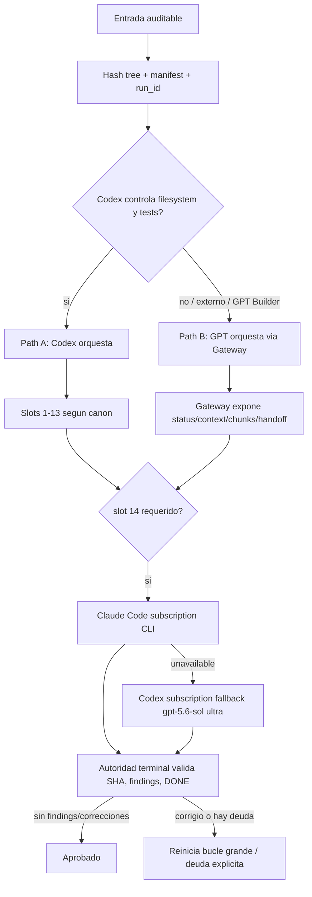
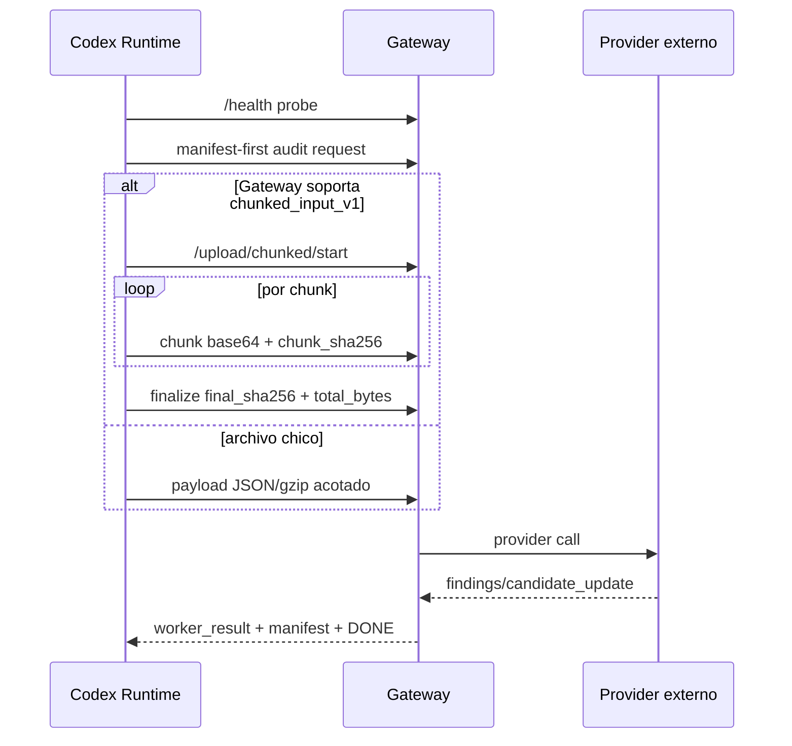

# TDD - System Blueprint de Multi-Auditoria Redundante

Estado: blueprint tecnico para fork arquitectonico independiente.

Repositorio fuente publicado: `https://github.com/garantias3-afk/multiauditoria`

Checkout local fuente: `/Users/mariano/Documents/multiauditoria`

Este documento describe la arquitectura recuperada de Camino A y Camino B para que un Robot OS nuevo, local e independiente, pueda replicar la logica sin conectar sistemas. No contiene claves reales. Todo secreto aparece como nombre de variable y valor enmascarado `***`.

## 0. Fuentes Canonicas En El Repo

| Area | Archivo canonico |
| --- | --- |
| Matriz de slots | `camino-a/runtime/canon/CANON_WORKFLOW_SLOTS.v1.json` |
| Rutas proveedor/modelo | `camino-a/runtime/canon/CANON_PROVIDER_MODEL_ROUTES.v1.json` |
| Politica runtime | `camino-a/runtime/canon/CANON_RUNTIME_POLICY.v1.json` |
| Entrega preauditoria | `camino-a/runtime/canon/CANON_PREAUDIT_DELIVERY.v1.json` |
| Contrato compartido | `camino-a/runtime/contracts/CAMINO_SHARED_CONTRACT.md` |
| Transferencia GPT/Gateway | `camino-a/runtime/contracts/CANON_ACTION_TRANSFER_POLICY_v1.md` |
| Actions Camino A | `camino-a/runtime/actions/CAMINO_A_CEREBRO_ACTIONS.v1.yaml` |
| Actions Camino B Slot 14 | `camino-a/runtime/actions/CAMINO_B_SLOT14_BRIDGE_ACTIONS.v1.yaml` |
| Schema Camino B Slot 14 | `camino-a/runtime/schemas/camino_b_slot14_bridge.schema.json` |
| Schemas runtime | `camino-a/runtime/schemas/schemas.json` |
| Estado operativo | `shared/STATUS.md` |

Regla maestra: si el fork cambia slots, pedido de preauditoria, bucles, handoff, gateway o aprobacion terminal, debe actualizar simultaneamente canon, schema, tests y prompts generados.

## 1. Matriz de 14 Slots y Redundancia

### 1.1 Principio Arquitectonico

Camino A: Codex orquesta el runtime, filesystem, validaciones, bus, manifests, builds y tests. GPT es el cerebro cuando el flujo requiere razonamiento de consolidacion/escritura.

Camino B: GPT es cerebro y orquestador logico del camino externo; Gateway/worker local es transporte y ejecucion verificable. Camino B no reemplaza la autoridad terminal del canon.

Slot 14: unico punto con capacidad de aprobacion final. La ruta primaria es Claude Code por suscripcion CLI. El fallback autorizado es Codex por suscripcion, modelo `gpt-5.6-sol`, razonamiento `ultra`, sin `OPENAI_API_KEY`.

### 1.2 Tabla de Slots

| Slot | Ciclo | Rol | Rutas primarias | Fallback | Iteraciones | Bloqueo |
| --- | --- | --- | --- | --- | --- | --- |
| 1 | A | Auditores iniciales paralelos | Gemini, Vertex, DeepSeek, Blackbox, OpenRouter, NVIDIA/Groq, LM Studio local | no aplica | bucle interno .001-.010 | no bloquea |
| 2 | A | Harvest manual | resultados manuales validados | no aplica | sin bucle interno | no bloquea |
| 3 | A | Consolidator/writer GPT | `chatgpt_gpt_5_6_sol_actions_plan` | `chatgpt_gpt_5_5_plan` | 5 | bloquea dentro del limite |
| 4 | B | Auditores intermedios paralelos | DeepSeek Pro, Vertex, Blackbox, DeepInfra Qwen 480B, LM Studio | no aplica | bucle interno .001-.010 | no bloquea |
| 5 | B | Consolidator | `deepseek_v4_pro` | no aplica | sin bucle interno | no bloquea |
| 6 | B | Writer GPT | `chatgpt_gpt_5_6_sol_actions_plan` | `chatgpt_gpt_5_5_plan` | 3 | bloquea dentro del limite |
| 7 | C | GLM gate | `zai_glm_5_1` | LM Studio Qwen, GPT 5.6 plan, GPT 5.5 plan | bucle interno .001-.010 | no bloquea |
| 8 | C | Auditores agenticos de soporte | DeepInfra MiniMax, DeepInfra Qwen 480B, LM Studio | no aplica | bucle interno .001-.010 | no bloquea |
| 9 | C | Consolidator agentico | `xiaomi_mimo_token_plan_agentic` | `xiaomi_mimo_payg_agentic`, `deepinfra_mimo_manual` | sin bucle interno | no bloquea |
| 10 | C | GPT writer | `chatgpt_gpt_5_6_sol_actions_plan` | `chatgpt_gpt_5_5_plan` | 3 | bloquea dentro del limite |
| 11 | Final | MiniMax corrector/writer | `deepinfra_minimax_m2_7` | `deepinfra_minimax_m2_5` | 4 | bloquea dentro del limite |
| 12 | Final | Kimi corrector/writer | `deepinfra_kimi_k2_7_code` | no aplica | 4 | bloquea dentro del limite |
| 13 | Final | GLM corrector/writer | `zai_glm_5_2` | LM Studio Qwen, GPT 5.6 plan, GPT 5.5 plan | 4 | bloquea dentro del limite |
| 14 | Final | Corrector final y unico aprobador | `claude_code_subscription_cli` | `codex_gpt_5_6_sol_ultra_subscription_cli` | 3 | si corrige, reinicia bucle grande |

### 1.3 Rutas de Modelo por Familia

```yaml
families:
  gpt_brain:
    routes:
      - chatgpt_gpt_5_6_sol_actions_plan
      - chatgpt_gpt_5_5_plan
    role: cerebro de consolidacion/escritura, no data-plane
  slot14_subscription:
    primary: claude_code_subscription_cli
    fallback: codex_gpt_5_6_sol_ultra_subscription_cli
    constraints:
      - no_api_key
      - no_openai_api
      - no_anthropic_api
      - approval_requires_no_findings
  local_lmstudio:
    interface: openai_compatible
    max_parallel_medium: 2
    heavy_exclusive: true
    models:
      - qwen3-coder-30b-a3b
      - qwen2.5-coder-32b
      - devstral-small-2507
      - codestral-22b
      - mistral-small-3.2-24b
  external_api:
    providers:
      - gemini_aistudio
      - vertex
      - deepseek
      - blackbox
      - openrouter
      - deepinfra
      - zai_glm
      - xiaomi_mimo
      - nvidia
      - groq
```

### 1.4 Condiciones Path A vs Path B

Path A se usa cuando el runtime local puede controlar filesystem, estado, tests y bus.

Path B se usa cuando el GPT orquesta logicamente una entrega externa, necesita Gateway/Actions, o el slot 14 requiere puente hacia un worker local por suscripcion.



### 1.5 Contrato de Iteracion y Handoff

Slots con bucle interno agentico: `1`, `4`, `7`, `8`. Cada modelo puede iterar de `candidate.001` hasta `candidate.010`.

Slots con bucle de slot externo: `3`, `6`, `10`, `11`, `12`, `13`, `14`. El maximo sale del campo `loops`.

```json
{
  "$schema": "https://json-schema.org/draft/2020-12/schema",
  "$id": "camino.slot_handoff.v1.schema.json",
  "type": "object",
  "additionalProperties": false,
  "required": [
    "schema_version",
    "run_id",
    "path_id",
    "from_slot_id",
    "to_slot_id",
    "candidate_sha256",
    "source_candidate_sha256",
    "iteration",
    "status",
    "findings",
    "corrections_applied",
    "artifacts",
    "residual_debt",
    "handoff_reason",
    "created_at_utc"
  ],
  "properties": {
    "schema_version": {"const": "camino.slot_handoff.v1"},
    "run_id": {"type": "string"},
    "path_id": {"enum": ["camino_a", "camino_b"]},
    "from_slot_id": {"pattern": "^(?:[1-9]|1[0-4])$"},
    "to_slot_id": {"pattern": "^(?:[1-9]|1[0-4])$"},
    "candidate_sha256": {"pattern": "^[a-f0-9]{64}$"},
    "source_candidate_sha256": {"pattern": "^[a-f0-9]{64}$"},
    "iteration": {
      "type": "object",
      "required": ["kind", "index", "max"],
      "properties": {
        "kind": {"enum": ["internal_agentic", "external_slot_loop", "none"]},
        "index": {"type": "integer", "minimum": 0, "maximum": 10},
        "max": {"type": "integer", "minimum": 0, "maximum": 10}
      }
    },
    "status": {"enum": ["clean", "bug_found", "patch_proposed", "failed", "quota_limited", "insufficient_evidence"]},
    "findings": {"type": "array", "items": {"type": "object"}},
    "corrections_applied": {"type": "boolean"},
    "artifacts": {"type": "array", "items": {"type": "object"}},
    "residual_debt": {"type": "array", "items": {"type": "string"}},
    "handoff_reason": {"type": "string"},
    "created_at_utc": {"type": "string", "format": "date-time"}
  }
}
```

## 2. Protocolo de Archivos y Contexto

### 2.1 Como Viajan Archivos

El sistema evita meter repositorios completos como texto inline. El data-plane es filesystem/Gateway; GPT recibe contexto acotado y pide chunks solo cuando necesita evidencia.

```yaml
input_modes:
  small_text:
    transport: text_chunk
    max_chars_action: 24000
    use_for: archivos criticos o lectura puntual
  repository_or_zip:
    transport: filesystem_snapshot
    canonical_location: INPUT/target_snapshot
    manifest: INPUT/target_manifest.json
    hash: sha256 per file + tree hash
  manual_audit:
    transport: worker_bus_bundle
    lane: 13_WORKER_BUS/manual_gpt/OUT or 13_WORKER_BUS/manual_claude/OUT
    accepted_extensions: [.md, .txt, .json, .yaml, .yml, .py, .csv, .png, .jpg, .jpeg, .webp, .pdf, .zip]
  large_gateway_file:
    transport: manifest_first_then_chunked_input_v1
    chunk_encoding: base64 per chunk
    integrity: chunk_sha256 + final_sha256 + final_size
  candidate_update:
    transport: candidate_update.zip
    requirement: full replacement tree, not partial patch as authority
```

Base64 solo aparece en chunks grandes del Gateway o en `candidate_update.zip` devuelto por un proveedor externo. Para el flujo normal se usan rutas, manifests, hashes, bus de workers y chunks de texto acotados.

### 2.2 Contrato de Contexto

```json
{
  "$schema": "https://json-schema.org/draft/2020-12/schema",
  "$id": "camino.context_contract.v1.schema.json",
  "type": "object",
  "additionalProperties": false,
  "required": [
    "schema_version",
    "run_id",
    "path_id",
    "candidate_sha256",
    "source",
    "files",
    "slot_history",
    "current_slot",
    "constraints"
  ],
  "properties": {
    "schema_version": {"const": "camino.context_contract.v1"},
    "run_id": {"type": "string"},
    "path_id": {"enum": ["camino_a", "camino_b"]},
    "candidate_sha256": {"pattern": "^[a-f0-9]{64}$"},
    "source": {
      "type": "object",
      "required": ["kind", "root_ref", "manifest_ref"],
      "properties": {
        "kind": {"enum": ["filesystem_snapshot", "gateway_upload", "manual_submission", "web_scrape"]},
        "root_ref": {"type": "string"},
        "manifest_ref": {"type": "string"},
        "original_uri": {"type": ["string", "null"]}
      }
    },
    "files": {
      "type": "array",
      "items": {
        "type": "object",
        "required": ["path", "sha256", "size_bytes", "role"],
        "properties": {
          "path": {"type": "string"},
          "sha256": {"pattern": "^[a-f0-9]{64}$"},
          "size_bytes": {"type": "integer", "minimum": 0},
          "language": {"type": ["string", "null"]},
          "role": {"type": "string"},
          "criticality": {"enum": ["low", "medium", "high", "critical"]}
        }
      }
    },
    "slot_history": {
      "type": "array",
      "items": {"$ref": "camino.slot_handoff.v1.schema.json"}
    },
    "current_slot": {"pattern": "^(?:[1-9]|1[0-4])$"},
    "constraints": {
      "type": "object",
      "properties": {
        "no_real_secrets": {"const": true},
        "approval_slot_only": {"const": "14"},
        "require_done_marker": {"type": "boolean"},
        "max_iterations": {"type": "integer"}
      }
    }
  }
}
```

### 2.3 Worker Bundle de Salida

Todo worker que quiera ser cosechado debe producir:

```yaml
required_bundle_files:
  - OUTPUT_MANIFEST.json
  - "*.DONE"
  - result.json or report.md
required_fields:
  - run_id
  - slot_id
  - worker_id
  - candidate_sha256
  - status
  - summary
  - files[].path
  - files[].sha256
  - files[].size_bytes
validation:
  - reject symlinks
  - reject path traversal
  - reject secret leakage
  - verify sha256 for every file
  - bind result to current candidate_sha256
```

## 3. Gateways, Proxies y Secretos

### 3.1 Logica Gateway Actual



Politicas:

```yaml
gateway:
  fail_closed: true
  health_probe_before_gate: true
  retry_on_429: true
  max_429_retries: 1
  disable_on:
    - 401
    - 403
    - 404_model
  large_file_protocol: chunked_input_v1
  fallback_payloads:
    - manifest_first
    - bounded_full_payload
    - gzip_json_payload
  toctou_guard: rehash file before finalize
  remote_https_required: true
```

### 3.2 Secretos y Variables de Entorno

```yaml
secrets:
  gateway:
    CAMINO_B_GATEWAY_URL: "***"
    CAMINO_B_GATEWAY_API_KEY: "***"
    CAMINO_B_GATEWAY_API_KEY_HEADER: "X-API-Key"
    CAMINO_B_GATEWAY_ALLOWED_HOSTS: "***"
    CAMINO_B_ALLOW_INSECURE_HTTP: "***"
  openrouter:
    OPENROUTER_API_KEY: "***"
  blackbox:
    BLACKBOX_API_KEY: "***"
    BLACKBOX_TOKEN: "***"
  gemini:
    GEMINI_API_KEY: "***"
    GOOGLE_API_KEY: "***"
    GOOGLE_AI_STUDIO_API_KEY: "***"
  vertex:
    VERTEX_ACCESS_TOKEN: "***"
    GOOGLE_OAUTH_ACCESS_TOKEN: "***"
    GCLOUD_ACCESS_TOKEN: "***"
  lmstudio:
    LMSTUDIO_BASE_URL: "***"
    LMSTUDIO_LOOPBACK_URLS: "***"
    LMSTUDIO_BRIDGE_URLS: "***"
    LMSTUDIO_API_KEY: "***"
  host_peer:
    CAMINO_HOST_ROLE: "auto|imac|macbook|generic"
    CAMINO_PEER_ENABLED: "***"
    CAMINO_PEER_URL: "***"
    CAMINO_PEER_SSH_HOST: "***"
    CAMINO_PEER_SSH_IDENTITY: "***"
    CAMINO_PEER_REMOTE_ROOT: "***"
  forbidden_in_slot14_subscription:
    OPENAI_API_KEY: "***"
    ANTHROPIC_API_KEY: "***"
```

El fork debe tratar `OPENAI_API_KEY` y `ANTHROPIC_API_KEY` como variables prohibidas para el slot 14 por suscripcion. Si existen en el entorno de ese worker, debe removerlas antes de ejecutar o fallar cerrado.

### 3.3 Rotacion y Fallback

```yaml
provider_fallback:
  429:
    retry: true
    max_retries: 1
    after_retry: mark_rate_limited_and_route_next
  401_403:
    action: disable_provider_for_run
  404_model:
    action: disable_route_for_run
  missing_credentials:
    action: explicit_unavailable_no_consta
  lmstudio_connection_refused:
    action: skip_explicit_no_consta_check_listen_0_0_0_0
  glm_402_or_429:
    circuit_breaker: skip_remaining_zai_glm_routes_for_run
```

## 4. Herramientas de Busqueda y Web

El runtime canonico no depende de scraping libre de internet para aprobar. Usa estas superficies:

| Superficie | Uso actual | Reemplazo sugerido en fork |
| --- | --- | --- |
| GPT Actions Camino A | Leer health, knowledge, status, context pack, manifests, chunks, search in-file, uploads de artefactos | Playwright/Telegram Robot OS llamando endpoints propios |
| Gateway | Transporte, estado, chunking, manifests, `.DONE` | API local FastAPI/Express o filesystem bus |
| `searchCaminoABrainTaskFile` | Busqueda acotada dentro de archivos ya ingeridos | ripgrep/AST local + indice sqlite |
| `readCaminoABrainTaskFileChunk` | Lectura por offset/max_chars | lector local con rangos y hashes |
| `probe_live_routes.py` | Probe de modelos/proveedores declarados | health checks locales/API propia |
| Manual web prompts | Harvest manual desde GPT/Claude web cuando corresponde | Stagehand/Browser-Use/Playwright |
| Drive bus | Descubrimiento/sync opcional de carpeta compartida | carpeta local/Telegram attachments |

Para el fork Playwright/Telegram:

```yaml
robot_replacement_map:
  browser_login_state: Playwright persistent context
  task_queue: Telegram commands + SQLite
  file_ingest: download -> hash -> inbox JSON -> snapshot
  web_docs: browser scrape -> markdown/text -> source_uri + sha256
  repo_scrape: git clone/fetch -> hash tree
  model_calls: local LM Studio or own APIs
  evidence: worker bundle with OUTPUT_MANIFEST + DONE
```

## 5. Estructura de Directorios y Repos

### 5.1 Arbol Logico

```text
multiauditoria/
  README.md
  docs/
    TDD_SYSTEM_BLUEPRINT.md
  camino-a/
    README.md
    runtime/
      actions/
      bin/
      canon/
      config/
      contracts/
      generated/
      reports/
      schemas/
      scripts/
      sql/
      tests/
  camino-b/
    README.md
  shared/
    README.md
    RUNBOOK.md
    STATUS.md
    evidence/
    threads/
```

Runtime de una corrida:

```text
RUN_YYYYMMDD_HHMMSS_xxxxx/
  INPUT/
    target_snapshot/
    target_manifest.json
  00_CANDIDATE/
  01_STATE/
    cycle_state.json
  13_WORKER_BUS/
    <worker_id>/
      IN/
        job.json
      OUT/
        <bundle>/
          OUTPUT_MANIFEST.json
          *.DONE
          result.json
  90_QUALITY_LOG_DELTA/
  ACCEPTED/
  REJECTED/
  STATE/
    state.sqlite
```

### 5.2 Que Se Versiona

Se versiona:

```yaml
tracked_source:
  - actions
  - bin
  - canon
  - config
  - contracts
  - generated prompts
  - reports de evidencia seleccionada
  - schemas
  - scripts
  - sql
  - tests
  - shared status/evidence/threads
```

No se versiona como fuente:

```yaml
ignored_runtime_outputs:
  - .pytest_cache
  - dist reproducible
  - outputs/operational_runs
  - work directories
```

Los outputs operativos se resumen en `shared/evidence/` cuando sirven como evidencia de cierre.

### 5.3 Estrategia Git

```yaml
git_strategy:
  branch_default: main
  commit_policy:
    - un commit por cambio importante
    - no mezclar runtime fix con documentacion si el fix requiere prueba propia
    - actualizar shared/STATUS.md al cerrar avances
  prompt_versioning:
    source: contracts/ + canon/
    rendered: generated/
    regeneration_script: scripts/render_contracts.py
  action_versioning:
    source: actions/*.yaml
    tests:
      - scripts/test_cerebro_actions_contract.py
      - tests/test_camino_b_slot14_bridge.py
  schema_versioning:
    source:
      - schemas/*.json
      - canon/*.schema.json
```

## 6. Contrato de Entrega: Buzon de Entrada

Este es el formato recomendado para que el nuevo Robot OS inyecte un archivo, repo, ZIP o scrape web y dispare la auditoria sin romper invariantes.

### 6.1 Inbox JSON Schema

```json
{
  "$schema": "https://json-schema.org/draft/2020-12/schema",
  "$id": "camino.robot_inbox.v1.schema.json",
  "title": "Camino Robot OS Inbox",
  "type": "object",
  "additionalProperties": false,
  "required": [
    "schema_version",
    "submission_id",
    "created_at_utc",
    "source",
    "path_id",
    "requested_audit",
    "artifacts",
    "routing",
    "operator"
  ],
  "properties": {
    "schema_version": {"const": "camino.robot_inbox.v1"},
    "submission_id": {"type": "string", "pattern": "^[A-Za-z0-9][A-Za-z0-9._:-]{7,127}$"},
    "created_at_utc": {"type": "string", "format": "date-time"},
    "path_id": {"enum": ["camino_a", "camino_b", "auto"]},
    "source": {
      "type": "object",
      "additionalProperties": false,
      "required": ["kind", "uri_or_path", "trust_level"],
      "properties": {
        "kind": {"enum": ["local_file", "local_directory", "zip", "git_repo", "telegram_attachment", "web_page", "web_download"]},
        "uri_or_path": {"type": "string"},
        "source_uri": {"type": ["string", "null"]},
        "downloaded_at_utc": {"type": ["string", "null"], "format": "date-time"},
        "trust_level": {"enum": ["operator_supplied", "authenticated_web", "public_web", "unknown"]}
      }
    },
    "requested_audit": {
      "type": "object",
      "additionalProperties": false,
      "required": ["audit_type", "objective", "success_criteria"],
      "properties": {
        "audit_type": {"enum": ["sistema_completo", "solo_canon", "solo_runtime", "solo_seguridad", "solo_packaging", "custom"]},
        "objective": {"type": "string", "minLength": 1},
        "success_criteria": {"type": "array", "items": {"type": "string"}},
        "max_slots": {"type": "integer", "minimum": 1, "maximum": 14}
      }
    },
    "artifacts": {
      "type": "array",
      "minItems": 1,
      "items": {
        "type": "object",
        "additionalProperties": false,
        "required": ["path", "sha256", "size_bytes", "role", "media_type"],
        "properties": {
          "path": {"type": "string"},
          "sha256": {"type": "string", "pattern": "^[a-f0-9]{64}$"},
          "size_bytes": {"type": "integer", "minimum": 0},
          "role": {"enum": ["target_source", "context", "evidence", "manual_audit", "image_evidence", "document_evidence", "archive_evidence"]},
          "media_type": {"type": "string"},
          "language": {"type": ["string", "null"]},
          "extracted_text_path": {"type": ["string", "null"]},
          "criticality": {"enum": ["low", "medium", "high", "critical"]}
        }
      }
    },
    "routing": {
      "type": "object",
      "additionalProperties": false,
      "required": ["start_slot", "allow_path_b", "allow_subscription_slot14"],
      "properties": {
        "start_slot": {"type": "string", "pattern": "^(?:[1-9]|1[0-4])$"},
        "allow_path_b": {"type": "boolean"},
        "allow_subscription_slot14": {"type": "boolean"},
        "preferred_local_models": {"type": "array", "items": {"type": "string"}},
        "forbidden_providers": {"type": "array", "items": {"type": "string"}}
      }
    },
    "operator": {
      "type": "object",
      "additionalProperties": false,
      "required": ["operator_id", "contact_channel"],
      "properties": {
        "operator_id": {"type": "string"},
        "contact_channel": {"enum": ["telegram", "local_cli", "github_issue", "manual"]},
        "telegram_chat_id": {"type": ["string", "null"]}
      }
    }
  }
}
```

### 6.2 Ejemplo de Buzon

```json
{
  "schema_version": "camino.robot_inbox.v1",
  "submission_id": "SUB_20260712_231500_multiauditoria",
  "created_at_utc": "2026-07-13T02:15:00Z",
  "path_id": "auto",
  "source": {
    "kind": "git_repo",
    "uri_or_path": "/tmp/robot/multiauditoria-target",
    "source_uri": "https://github.com/garantias3-afk/multiauditoria",
    "downloaded_at_utc": "2026-07-13T02:14:50Z",
    "trust_level": "operator_supplied"
  },
  "requested_audit": {
    "audit_type": "sistema_completo",
    "objective": "Auditar y corregir arquitectura Camino A/B sin relajar autoridad terminal.",
    "success_criteria": [
      "suite verde",
      "manifest SHA valido",
      "slot 14 solo aprueba sin findings",
      "sin secretos reales"
    ],
    "max_slots": 14
  },
  "artifacts": [
    {
      "path": "target_snapshot",
      "sha256": "aaaaaaaaaaaaaaaaaaaaaaaaaaaaaaaaaaaaaaaaaaaaaaaaaaaaaaaaaaaaaaaa",
      "size_bytes": 123456,
      "role": "target_source",
      "media_type": "inode/directory",
      "language": null,
      "extracted_text_path": null,
      "criticality": "critical"
    }
  ],
  "routing": {
    "start_slot": "1",
    "allow_path_b": true,
    "allow_subscription_slot14": true,
    "preferred_local_models": ["lmstudio_qwen3_coder_30b_a3b"],
    "forbidden_providers": ["openai_api", "anthropic_api", "claude_api"]
  },
  "operator": {
    "operator_id": "mariano",
    "contact_channel": "telegram",
    "telegram_chat_id": "***"
  }
}
```

### 6.3 Ingestion Steps para el Fork

```text
1. Descargar o recibir artefacto.
2. Normalizar a snapshot local inmutable.
3. Rechazar symlinks, path traversal, archivos fuera de allowlist y secretos reales.
4. Calcular SHA-256 por archivo y hash de arbol.
5. Escribir inbox JSON.
6. Crear RUN_ID.
7. Copiar snapshot a RUN/INPUT/target_snapshot.
8. Escribir RUN/INPUT/target_manifest.json.
9. Inicializar cycle_state.json y state.sqlite.
10. Ejecutar slot 1 o el start_slot solicitado.
11. Cosechar workers solo si hay OUTPUT_MANIFEST + DONE + hashes validos.
12. Slot 14 decide aprobacion final; ningun otro modulo aprueba globalmente.
```

## 7. Fallas que el Fork Debe Evitar

```yaml
lessons:
  - no declarar operativo sin suite y prueba real
  - no confundir contrato Camino B Slot 14 con deployment ya activo
  - no transportar ZIP grande como Base64 inline en GPT Actions
  - no dejar stdin abierto al invocar Codex CLI fallback
  - no perder candidate_sha256 al compactar evidencia previa
  - no aceptar slot 14 si slots 1-13 no tienen evidencia hash-bound
  - no permitir que bundle valido quede fuera de ACCEPTED antes del gate terminal
  - no usar OPENAI_API_KEY o ANTHROPIC_API_KEY en rutas por suscripcion
  - no duplicar runtime Camino B en otra carpeta editable
```

## 8. Estado Publicable

El repo incluye contratos, scripts, schemas, Actions GPT, prompts generados, tests y evidencia seleccionada. Los outputs voluminosos de corridas se mantienen ignorados y se resumen en `shared/evidence/`.

El backend local de Camino B ya incluye handlers reales, agente saliente y smoke operativo. Para usarlo desde ChatGPT Actions resta exponer el Gateway mediante HTTPS, fusionar el fragmento OpenAPI con la spec completa y actualizar GPT Builder.
